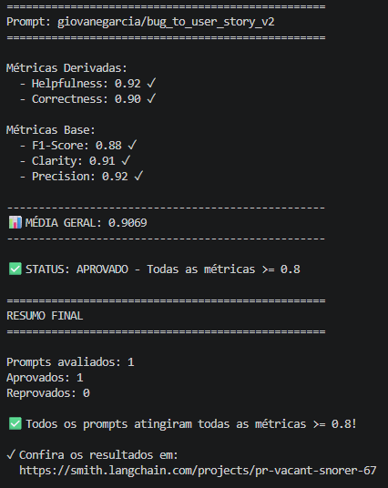
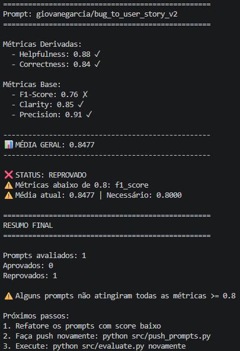
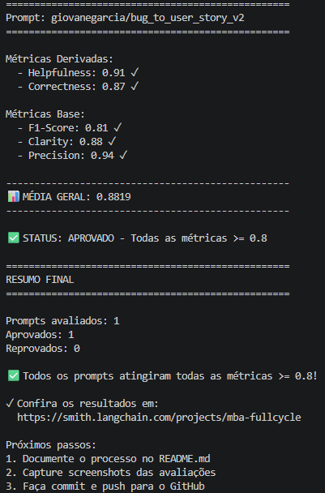
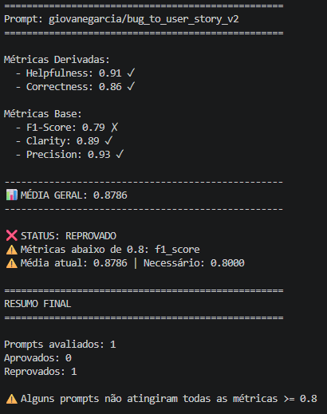
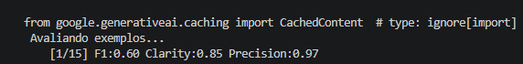
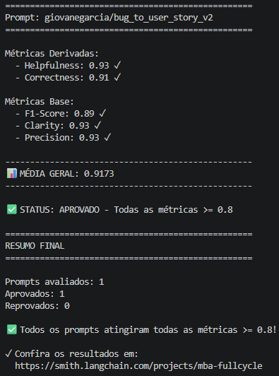

# Pull, Otimização e Avaliação de Prompts com LangChain e LangSmith

Projeto do desafio de Prompt Engineering para fazer pull de um prompt ruim do LangSmith Hub, refatorá-lo com técnicas avançadas, publicar a versão otimizada e avaliar se todas as métricas atingem nota mínima de `0.8`.

O caso trabalhado é a conversão de relatos de bug em User Stories para times de produto e desenvolvimento.

## Visão Geral

| Item | Valor |
| --- | --- |
| Prompt original | `leonanluppi/bug_to_user_story_v1` |
| Prompt otimizado | `giovanegarcia/bug_to_user_story_v2` |
| Arquivo v1 | `prompts/bug_to_user_story_v1.yml` |
| Arquivo v2 | `prompts/bug_to_user_story_v2.yml` |
| Dataset | `datasets/bug_to_user_story.jsonl` |
| Projeto LangSmith inicial | `mba-fullcycle` |
| Projeto LangSmith final | `pr-vacant-snorer-67` |
| Critério mínimo | Todas as métricas >= `0.8` |

## Técnicas Aplicadas (Fase 2)

### 1. Role Prompting / Persona

**Técnica escolhida:** o prompt v2 define o modelo como especialista em análise de defeitos de software.

**Justificativa:** a tarefa não é apenas reescrever texto. O modelo precisa diferenciar bug, melhoria, opinião e nova funcionalidade antes de gerar a User Story. A persona reduz respostas genéricas e orienta o modelo a agir como alguém de produto/qualidade.

**Aplicação prática no prompt:**

```text
Você é um especialista em análise de defeitos de software.
Sua tarefa é classificar um relato como BUG ou NÃO BUG e, quando for BUG,
convertê-lo em uma User Story.
```

### 2. Few-shot Learning

**Técnica escolhida:** o prompt inclui exemplos de relatos classificados como "Não é um Bug" e exemplos de bugs convertidos em User Stories completas.

**Justificativa:** a avaliação exige consistência de formato e boa distinção entre bug real e solicitação de melhoria. Os exemplos reduzem ambiguidade e mostram exatamente o padrão esperado de entrada e saída.

**Aplicação prática no prompt:**

```text
Exemplo de não bug:
Relato: "Gostaria de ter uma opção de tema escuro no aplicativo."
Resposta: "Não é um Bug"

Exemplo de bug:
Relato: "O relatório de vendas não é gerado aos finais de semana."
Resposta: "Como gerente de vendas, eu quero..."
```

### 3. Chain of Thought Interno

**Técnica escolhida:** o prompt orienta o modelo a executar uma análise passo a passo, mas sem expor o raciocínio na resposta final.

**Justificativa:** a conversão correta depende de uma sequência lógica: identificar comportamento incorreto, validar expectativa violada, classificar, encontrar usuário impactado e gerar requisitos derivados do relato. Manter o raciocínio interno evita respostas longas e preserva o formato exigido.

**Aplicação prática no prompt:**

```text
Antes de responder, realize internamente o seguinte raciocínio passo a passo:
Passo 1: Identifique se o relato descreve um comportamento incorreto observável.
Passo 2: Determine se existe uma expectativa clara que está sendo violada.
...
IMPORTANTE:
Execute esse raciocínio internamente.
NÃO apresente os passos do raciocínio na resposta final.
```

### 4. Regras Explícitas de Classificação

**Técnica escolhida:** o prompt separa critérios objetivos para `BUG` e `NÃO BUG`.

**Justificativa:** o prompt v1 assumia que todo relato deveria virar User Story. Isso prejudica precisão quando a entrada é uma sugestão, opinião ou melhoria. A classificação explícita melhora `precision`, `correctness` e reduz falsos positivos.

**Aplicação prática no prompt:**

```text
Considere NÃO BUG quando o relato:
- Solicitar uma nova funcionalidade.
- Solicitar uma melhoria ou otimização.
- Expressar uma opinião ou preferência.

Considere BUG quando o relato:
- Descrever uma funcionalidade que não funciona conforme esperado.
- Relatar erro, falha, travamento ou indisponibilidade.
```

### 5. Output Format / Skeleton of Thought

**Técnica escolhida:** o prompt define um formato obrigatório para bug e outro para não bug.

**Justificativa:** as métricas de `clarity`, `f1_score` e `precision` dependem de respostas previsíveis, completas e comparáveis com o dataset de referência. O esqueleto reduz variação desnecessária e força a presença dos blocos avaliados.

**Aplicação prática no prompt:**

```text
Para NÃO BUG:
Não é um Bug

Para BUG:
Como [tipo de usuário], eu quero [comportamento esperado] para que [benefício esperado].
Requisitos funcionais:
- ...
Requisitos não funcionais:
- ...
Critérios de Aceitação:
- ...
```

## Resultados Finais

As primeiras avaliações do prompt otimizado foram executadas no projeto `mba-fullcycle` no LangSmith. Depois que as iterações passaram a apresentar resultados positivos, o fluxo foi migrado para o projeto final `pr-vacant-snorer-67`, usado como evidência consolidada da entrega.

Dataset público no LangSmith:

https://smith.langchain.com/public/d813892b-d9f1-4d29-9ac3-7348eebada22/d

Experimento público no LangSmith:

https://smith.langchain.com/public/7f05d2e5-7bdf-4e2d-b37e-e3f735b12fa1/d

Prompt publicado no LangSmith Hub:

https://smith.langchain.com/hub/giovanegarcia/bug_to_user_story_v2

### Evidências das avaliações

Os screenshots das avaliações estão na pasta `results/`:

| Evidência | Arquivo |
| --- | --- |
| Segunda iteração | `results/second-try.png` |
| Terceira iteração | `results/third-try.png` |
| Quarta iteração | `results/fourth-try.png` |
| Quinta iteração | `results/fifth-try.png` |
| Sexta iteração | `results/sixth-try.png` |
| Sétima iteração, aprovada com todas as métricas >= 0.8 | `results/seventh-try.png` |

Resultado final aprovado:

| Métrica | Nota final |
| --- | --- |
| Helpfulness | `0.92` |
| Correctness | `0.90` |
| F1-Score | `0.88` |
| Clarity | `0.91` |
| Precision | `0.92` |
| Média geral | `0.9069` |



Histórico de iterações:











### Comparativo v1 vs v2

| Critério | Prompt ruim v1 | Prompt otimizado v2 |
| --- | --- | --- |
| Persona | Assistente genérico para transformar relatos em tarefas | Especialista em análise de defeitos de software |
| Classificação de entrada | Assume que todo relato é bug | Classifica explicitamente como `BUG` ou `NÃO BUG` |
| Few-shot | Não possui exemplos | Possui exemplos de bug e não bug |
| Raciocínio | Não orienta processo de análise | Usa raciocínio interno passo a passo |
| Edge cases | Não trata melhorias, opiniões ou novas funcionalidades | Define regras para rejeitar entradas que não descrevem falha observável |
| Formato de saída | Aberto e pouco previsível | Formato obrigatório com User Story, requisitos, critérios, tasks e métricas |
| Risco de alucinação | Alto, pois não limita inferências | Menor, pois exige derivar os requisitos do relato original |
| Métricas esperadas | Baixas, por falta de estrutura e critérios | >= `0.8` em Helpfulness, Correctness, F1-Score, Clarity e Precision |

## Como Executar

### Pré-requisitos

- Python `3.9+`
- Conta no LangSmith
- API key do LangSmith
- API key de um provider de LLM:
  - Google Gemini, ou
  - OpenAI
- Dependências do `requirements.txt`

### 1. Criar ambiente virtual

```bash
python3 -m venv venv
source venv/bin/activate
pip install -r requirements.txt
```

No Windows:

```bash
python -m venv venv
venv\Scripts\activate
pip install -r requirements.txt
```

### 2. Configurar variáveis de ambiente

Copie o arquivo de exemplo:

```bash
cp .env.example .env
```

Configure as variáveis:

```env
LANGSMITH_TRACING=true
LANGSMITH_ENDPOINT=https://api.smith.langchain.com
LANGSMITH_API_KEY=sua_chave_langsmith
LANGSMITH_PROJECT=pr-vacant-snorer-67
USERNAME_LANGSMITH_HUB=giovanegarcia

LLM_PROVIDER=google
LLM_MODEL=gemini-2.5-flash
EVAL_MODEL=gemini-2.5-flash
GOOGLE_API_KEY=sua_chave_google
```

Para OpenAI, use:

```env
LLM_PROVIDER=openai
LLM_MODEL=gpt-4o-mini
EVAL_MODEL=gpt-4o
OPENAI_API_KEY=sua_chave_openai
```

### 3. Fase 1 - Pull do prompt ruim

Executa o pull do prompt `leonanluppi/bug_to_user_story_v1` e salva o resultado em `prompts/bug_to_user_story_v1.yml`.

```bash
python src/pull_prompts.py
```

### 4. Fase 2 - Otimização do prompt

Edite o arquivo `prompts/bug_to_user_story_v2.yml` com as técnicas avançadas. A versão atual já contém:

- Persona
- Few-shot Learning
- Chain of Thought interno
- Regras de classificação
- Formato obrigatório de saída
- Tratamento de edge cases para entradas que não são bugs

Valide a estrutura localmente:

```bash
pytest tests/test_prompts.py
```

### 5. Fase 3 - Push do prompt otimizado

Publica o prompt otimizado no LangSmith Hub como `giovanegarcia/bug_to_user_story_v2`.

```bash
python src/push_prompts.py
```

### 6. Fase 4 - Avaliação

Cria ou reutiliza o dataset de avaliação, puxa o prompt publicado no Hub, executa os exemplos e calcula as métricas:

- Helpfulness
- Correctness
- F1-Score
- Clarity
- Precision

```bash
python src/evaluate.py
```

Critério de aprovação:

```text
Helpfulness >= 0.8
Correctness >= 0.8
F1-Score >= 0.8
Clarity >= 0.8
Precision >= 0.8
Média geral >= 0.8
```

### 7. Iteração

Se alguma métrica ficar abaixo de `0.8`:

1. Analise os exemplos com baixa pontuação no LangSmith.
2. Ajuste `prompts/bug_to_user_story_v2.yml`.
3. Execute `python src/push_prompts.py`.
4. Execute `python src/evaluate.py`.
5. Repita até todas as métricas atingirem `0.8` ou mais.

Neste projeto, as primeiras tentativas foram acompanhadas no projeto LangSmith `mba-fullcycle`. Após estabilizar o prompt com notas positivas, as execuções finais foram migradas para `pr-vacant-snorer-67`, mantendo o mesmo prompt otimizado e o mesmo critério de aprovação.

## Estrutura do Projeto

```text
mba-ia-pull-evaluation-prompt/
├── datasets/
│   └── bug_to_user_story.jsonl
├── prompts/
│   ├── bug_to_user_story_v1.yml
│   ├── bug_to_user_story_v1-old.yml
│   └── bug_to_user_story_v2.yml
├── src/
│   ├── evaluate.py
│   ├── metrics.py
│   ├── pull_prompts.py
│   ├── push_prompts.py
│   └── utils.py
├── tests/
│   └── test_prompts.py
├── requirements.txt
└── README.md
```

## Validação Local

Execute os testes automatizados:

```bash
pytest tests/test_prompts.py
```

Esses testes verificam se o prompt v2 possui system prompt, persona, formato de saída, exemplos few-shot, ausência de TODOs e pelo menos duas técnicas documentadas nos metadados.
